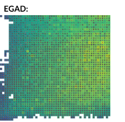

*[Doug Morrison](https://dougsm.com), [Peter Corke](http://petercorke.com) and [Juxi Leitner](http://juxi.net)*

Under Review for RA-L and IROS 2020.

Preprint: [https://arxiv.org/abs/2003.01314](https://arxiv.org/abs/2003.01314)

Code: [https://github.com/dougsm/egad/](https://github.com/dougsm/egad/)

---

EGAD is a dataset of over 2000 geometrically diverse object meshes created specifically with robotic grasping and manipulation in mind (above left).

Diverse and extensive training data are critical to training modern robotic systems to grasp, and yet many systems are trained on small or non-diverse datasets repurposed from other domains.  We used evoluationary algorithms to create a set of objects which uniformly span the object space of simple to complex,
and easy to difficult to grasp, with a focus on geometric diversity.  The objects are all easily 3D-printable, making 1:1 sim-to-real transfer possible.  

We specify an evaluation set of 49 diverse objects with a gradient of complexity and difficulty which can be used to evaluate robotic grasping systems in the real world (above right).   

---

## Object Model Download

Training Object Model Set (2282 .obj models): [egad_train_set.zip (260MB)](http://s.dougsm.com/egad/egad_train_set.zip)

Evaluation Object Model Set (49 .obj models):  [egad_eval_set.zip (6MB)](http://s.dougsm.com/egad/egad_eval_set.zip)

For viewing and manipulating object meshes, we recommend [meshlab](http://www.meshlab.net/) or the [trimesh python library](https://trimsh.org/index.html).

### A note on naming conventions

The zip files above contain sets of .obj mesh files.  

Files are labelled corresponding to their position in the search space grid, as a letter and a number.
The letter corresponds to the 75th percentile grasp quality, where a higher letter corresponds to more difficult to grasp.
The number corresponds to the complexity of the object, where a higher number corresponds to more complex.

The Evaluation set is labelled in a 7x7 grid using the same conventions as the paper.
A0.obj is the simplest, easiest to grasp object, through to G6.obj, the most complex, difficult to grasp object.

For the Training set, objects are labelled in a 25x25 grid. There up to 4 meshes per cell, so a third digit corresponds to this index.
A00\_[0-3].obj corresponds to the simplest, 
easiest to grasp cell in the search space, and Y25\_[0-3].obj corresponds to the most complex, most difficult to grasp cell.
(NB: The highest filled cell is X25)

### Scaling Objects and 3D Printing

We provide a [script and instructions here](https://github.com/dougsm/egad/) for scaling the objects to a specific gripper size.

---

## Dex-Net Compatible Data

We also provide a database of objects in the Dex-Net HDF5 format. 
This file can be accessed and manipulated using the Dex-Net command line tool, the extensive documentation for which can be found [here](https://berkeleyautomation.github.io/dex-net/code.html).
Using the Dex-Net API, you can sample and rank grasps on the objects using a wide variety of grippers and quality metrics, and additionally export data for training visual grasp detection algorithms.

Download Link:  [egad.hdf5 (*19GB*)](http://s.dougsm.com/egad/egad_310320.hdf5)

The database contains pre-computed antipodal grasps annotated with robust Ferrari Canny quality metrics for all objects in EGAD.

--- 

## Visualisation

The figures below compare the EGAD dataset to the popular Dex-Net and YCB object datasets in the space of simple to complex (left to right) and easy to difficult to grasp (bottom to top).  Compared to these datsets, EGAD has much higher coverage of the object space as well as higher inter-object geometric diversity.  See [the paper](https://arxiv.org/abs/2003.01314) for more details.

Click the images below to access high-resolution versions of the images.

     

---

## Videos

Grasping experiments performed using Franka-Emika Panda robot and [GG-CNN](https://github.com/dougsm/mvp_grasp/) (10x speedup).  We performed 20 grasp attempts on each of the evaluation objects, which allow us to perform an in-depth analysis of the strenghts and limitations of GG-CNN.  See [the paper](https://arxiv.org/abs/2003.01314) for more details.

<iframe width="560" height="315" src="https://www.youtube.com/embed/fae8f5KqiQs" frameborder="0" allow="accelerometer; autoplay; encrypted-media; gyroscope; picture-in-picture" allowfullscreen></iframe>

EGAD is generated using evolutionary algorithms, where we uniformly fill the search space of objects across complexity and difficulty. This video shows the progress of the dataset creation over 200,000 evolutionary steps.

<iframe width="560" height="315" src="https://www.youtube.com/embed/X42A3Qjy8E4" frameborder="0" allow="accelerometer; autoplay; encrypted-media; gyroscope; picture-in-picture" allowfullscreen></iframe>

---

## Dataset Creation

Please see the [master branch](https://github.com/dougsm/egad/) for instructions on running the code for generating an Evolved dataset of objects.  We provide a Singularity container to easy deployment and reproduction.  

---

## Research Supported By

&nbsp;&nbsp;&nbsp;&nbsp;&nbsp;

---

## References and Acknowledgements

This project wouldn't have been possible without the following libraries:

- Dex-Net: [https://github.com/BerkeleyAutomation/dex-net](https://github.com/BerkeleyAutomation/dex-net)
- Reeb Graphs: [https://github.com/dbespalov/reeb_graph](https://github.com/dbespalov/reeb_graph)
- NEAT-Python: [https://neat-python.readthedocs.io/en/latest/](https://neat-python.readthedocs.io/en/latest/)
- PyTorch-NEAT: [https://github.com/dougsm/PyTorch-NEAT](https://github.com/dougsm/PyTorch-NEAT), originally [https://github.com/uber-research/PyTorch-NEAT](https://github.com/uber-research/PyTorch-NEAT)
- Trimesh: [https://trimsh.org/index.html](https://trimsh.org/index.html)
- V-HACD: [https://github.com/kmammou/v-hacd](https://github.com/kmammou/v-hacd)
