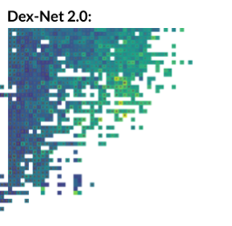

*[Doug Morrison](dougsm.com), [Peter Corke](petercorke.com) and [Juxi Leitner](juxi.net)*

Under Review for RA-L and IROS 2020.

Preprint: Coming Soon

---

EGAD is a dataset of over 2000 geometrically object meshes created with robotic grasping and manipulation in mind.

Diverse and extensive training data are critical to training modern robotic systems to grasp, and yet many systems are training on limited and non-diverse datasets repurposed from other domains.  We used evoluationary algorithms to create a set of objects which uniformly span the object space of simple to complex,
and easy to difficult to grasp, with a focus on geometric diversity.  The objects are all easily 3D-printable, making 1:1 sim-to-real transfer possible.  
Additionally, we specify an evaluation set of 49 diverse objects with a gradient of difficulty which can be used to evaluate robotic grasping systems in the real world.   

---

## Object Model Download

Training Object Model Set (2282 .obj models): [egad_train_set.zip (260MB)](http://s.dougsm.com/egad/egad_train_set.zip)

Evaluation Object Model Set (49 .obj models):  [egad_eval_set.zip (6MB)](http://s.dougsm.com/egad/egad_eval_set.zip)

For viewing and manipulating object meshes, we recommend [meshlab](http://www.meshlab.net/) or the [trimesh python library](https://trimsh.org/index.html).

### A note on naming conventions

The zip files above contain sets of .obj mesh files.  

Files are labelled corresponding to their position in the search space grid, as a letter and a number.
The letter corresponds to the 75th percentile grasp quality, where a higher letter corresponds to more difficult to grasp.
The number corresponds to the complexity of the object, where a higher number corresponds to more complex.

The Evaluation set is labelled in a 7x7 grid using the same conventions as the paper.
A0.obj is the simplest, easiest to grasp object, through to G6.obj, the most complex, difficult to grasp object.

For the Training set, objects are labelled in a 25x25 grid. There up to 4 meshes per cell, so a third digit corresponds to this index.
A00\_[0-3].obj corresponds to the simplest, 
easiest to grasp cell in the search space, and Y25\_[0-3].obj corresponds to the most complex, most difficult to grasp cell.
(NB: The highest filled cell is X25)

---

## Dex-Net Compatible Data

We also provide a databas of objects in the Dex-Net HDF5 database format. 
This file can be accessed and manipulated using the Dex-Net command line tool, the extensive documentation for which can be found [here](https://berkeleyautomation.github.io/dex-net/code.html).
Using the Dex-Net API, you can sample and rank grasps on the objects using a wide variety of grippers and quality metrics, and additionally export data for training visual grasp detection algorithms.

Download Link:  [egad.hdf5 (*19GB*)](http://s.dougsm.com/egad/egad_040220.hdf5)

The database contains pre-computed antipodal grasps annotated with robust Ferrari Canny quality metrics for all objects in EGAD.

--- 

## Visualisation

Click the images below to access high-resolution versions of the dataset comparisons in the paper.

     

---

## Videos

<iframe width="560" height="315" src="https://www.youtube.com/embed/fae8f5KqiQs" frameborder="0" allow="accelerometer; autoplay; encrypted-media; gyroscope; picture-in-picture" allowfullscreen></iframe>

<iframe width="560" height="315" src="https://www.youtube.com/embed/X42A3Qjy8E4" frameborder="0" allow="accelerometer; autoplay; encrypted-media; gyroscope; picture-in-picture" allowfullscreen></iframe>